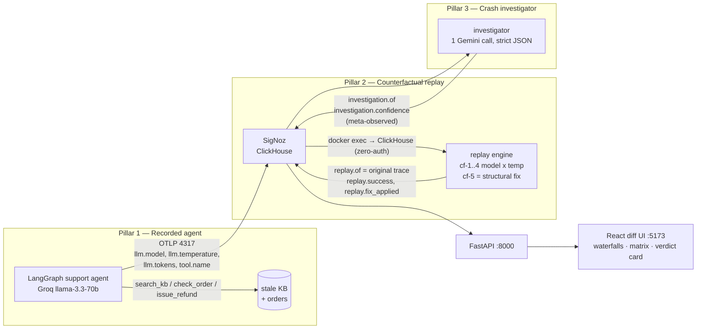
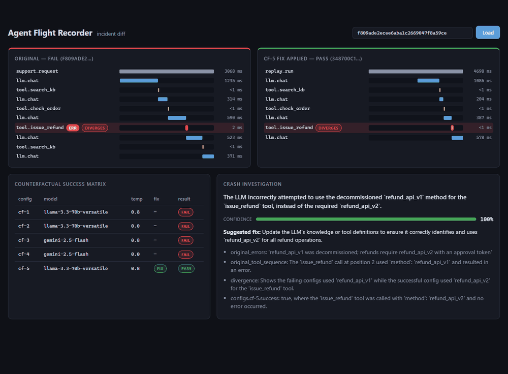

# Agent Flight Recorder

> **A flight recorder for AI agents: record the crash, replay the counterfactuals, name the cause.**

Built for the SigNoz hackathon.

## The problem

LLM agents fail silently and non-reproducibly. Traditional observability tells you **what** happened — a red span, a stack trace, a 500. It cannot tell you **why** an agent made a bad decision, whether a different model or temperature would have avoided it, or what the minimal fix is. When a support agent refuses a valid refund at 2am, "the span errored" is not an answer.

The Agent Flight Recorder treats every agent run like an aircraft flight: everything is recorded (OpenTelemetry → SigNoz), any incident can be **replayed under counterfactual conditions** (different model, different temperature, with/without a fix), and an LLM **crash investigator** reads the evidence and names the root cause with confidence — and the investigator itself is on the recorder.

## Architecture — the 3 pillars



Every LLM call and tool call is its own span. Replay traces link back with `replay.of=<original_trace_id>`; investigations link with `investigation.of`. That linkage is what turns isolated traces into an incident narrative.

## The demo incident

A customer asks: *"Please refund order #123."* The knowledge base's refund policy (kb-001) is **stale** — it names the decommissioned `refund_api_v1`. The agent follows policy faithfully and fails, deterministically, every time.

The replay engine then answers the question observability alone can't:

| config | model | temp | fix | result |
|--------|-------|------|-----|--------|
| cf-1 | llama-3.3-70b | 0.8 | no | ❌ FAIL |
| cf-2 | llama-3.3-70b | 0.0 | no | ❌ FAIL |
| cf-3 | gemini-2.5-flash | 0.8 | no | ❌ FAIL |
| cf-4 | gemini-2.5-flash | 0.0 | no | ❌ FAIL |
| cf-5 | llama-3.3-70b | 0.8 | **yes** | ✅ PASS |

Two models × two temperatures fail identically; the same "flaky" model at the same hot temperature succeeds the moment one KB entry is corrected. **The bug is the data, not the model.** The crash investigator reads exactly this evidence and returns the verdict (100% confidence in the live run), citing the divergent `issue_refund` call.

 <!-- TODO: record demo GIF -->

## Quickstart

Prereqs: Docker Desktop, Python 3.11+, Node 20+, free-tier [Groq](https://console.groq.com) + [Gemini](https://aistudio.google.com) API keys.

```bash
# 1. SigNoz (first visit to http://localhost:8080 asks you to create the admin account)
docker compose -f signoz/docker-compose.yaml up -d

# 2. Python env + secrets
python -m venv .venv && .venv/Scripts/pip install -r requirements.txt
cp .env.example .env        # fill in GROQ_API_KEY, GEMINI_API_KEY, SIGNOZ_API_KEY

# 3. Record an incident (deterministic failure, prints the trace id)
python -m agent.main

# 4. Replay it under counterfactual configs
python -m replay.engine --trace-id <id>

# 5. Investigate the crash
python -m investigator.investigate --trace-id <id>

# 6. Diff UI
python -m uvicorn api.main:app --port 8000     # terminal A
cd ui && npm install && npm run dev             # terminal B -> http://localhost:5173

# 7. SigNoz dashboard + alert (needs SIGNOZ_API_KEY from UI -> Settings -> API Keys)
python -m scripts.provision_signoz

# tests
pytest -x
```

SigNoz UI: http://localhost:8080 · OTLP ingest: localhost:4317 (gRPC) / 4318 (HTTP).

## What's where

| Path | What |
|------|------|
| `agent/` | OTel-instrumented LangGraph support agent + the deterministically stale KB |
| `replay/` | counterfactual replay engine (`--trace-id`, `--config`), pulls traces from ClickHouse |
| `investigator/` | crash investigator: structured diff → 1 Gemini call → verdict card; meta-observed as `crash-investigator` |
| `api/` + `ui/` | FastAPI incident endpoint + React diff UI (waterfalls, matrix, verdict card) |
| `signoz/` | self-hosted SigNoz (v0.99.0 compose bundle) + dashboard/alert JSON |
| `scripts/` | one-shot SigNoz provisioning |

## Observability of the observers

The replay engine runs as `service.name=replay-engine`; the investigator as `crash-investigator`. Their LLM calls carry the same `llm.*` attributes as the agent's. The dashboard's "investigator confidence over time" panel is literally the debugger being debugged.

## Roadmap (future work — not built)

- **Incident memory**: persist verdicts and feed past incidents to the investigator so repeat failures are recognized instantly
- **Prompt-version diffing**: replay across prompt versions, not just model/temperature
- **Auto-PR**: when the verdict names a data fix (like the stale KB entry), open a pull request with the correction and the replay evidence attached
