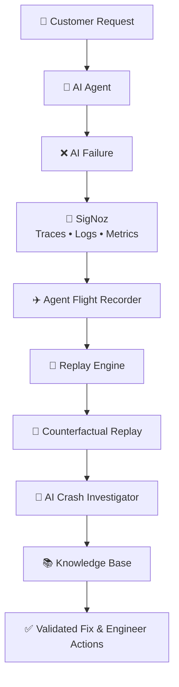
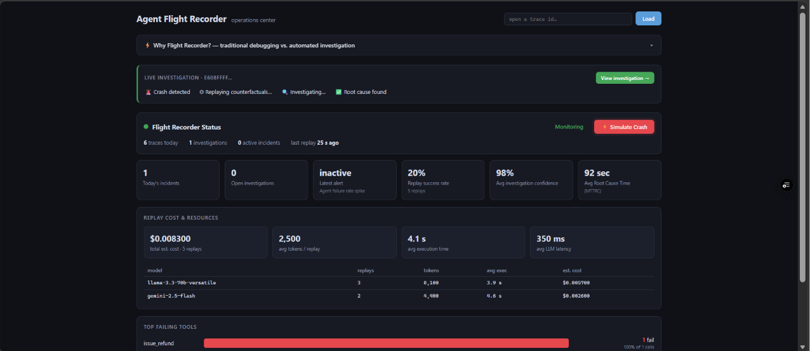
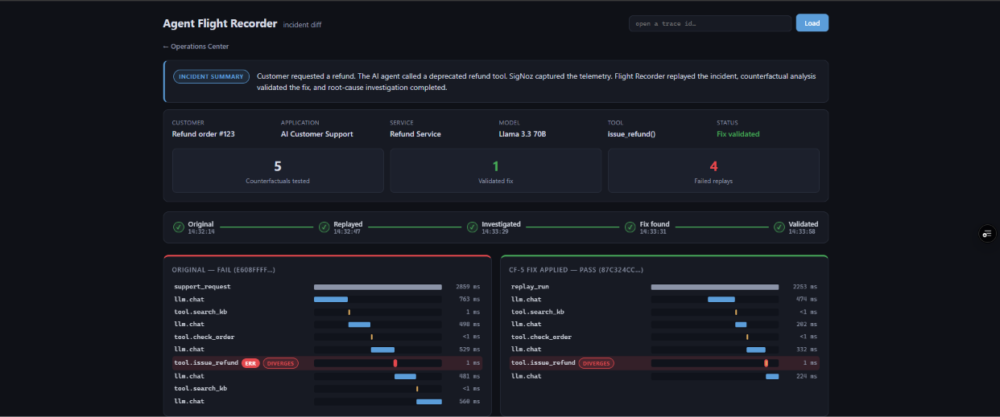
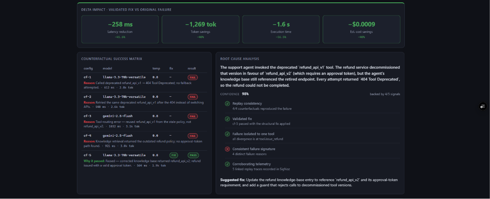
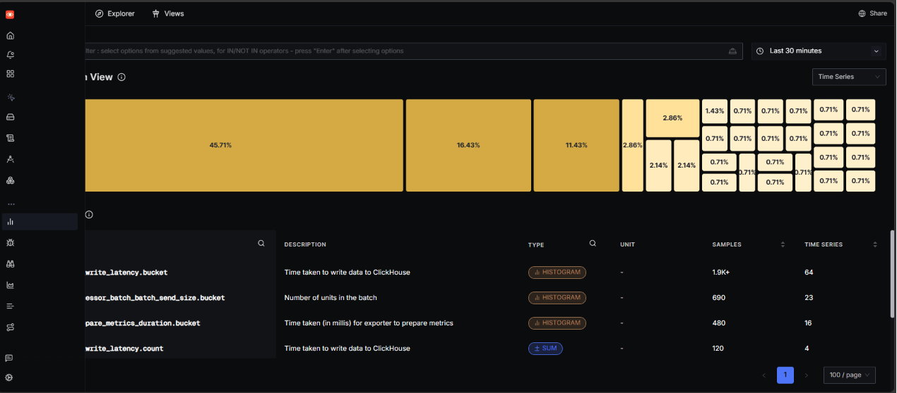
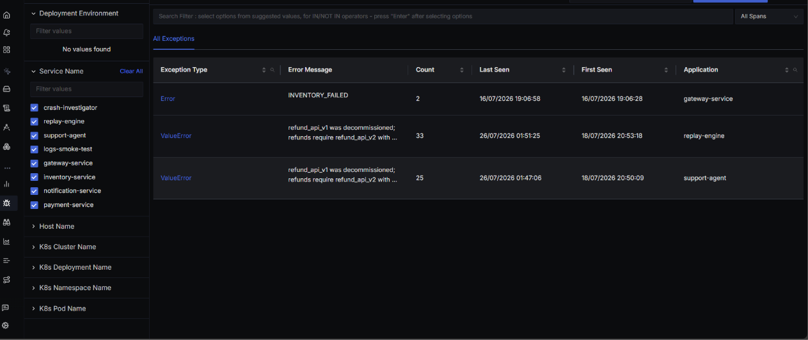
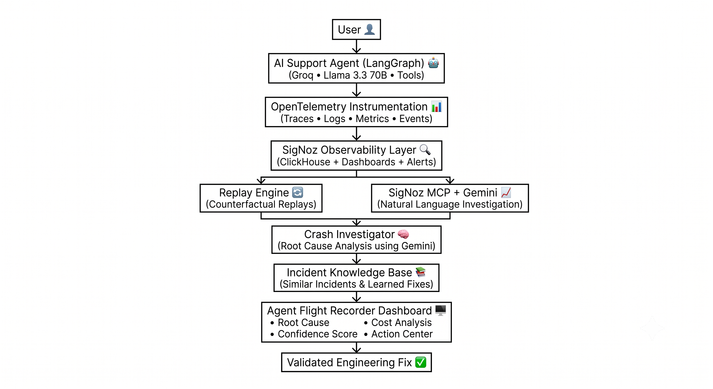

<p align="center">

</p>

<div align="center">

# ✈️ Agent Flight Recorder

### A flight recorder for AI agents — record the crash, replay the counterfactuals, name the root cause.

OpenTelemetry-native incident investigation for LLM agents, built for the **SigNoz AI Observability Hackathon**.


</div>

---

## 🎬 Demo

<p align="center">
  
</p>

<p align="center">

🎥 **[Watch Our 3-Minute Demo](https://www.youtube.com/watch?v=CaW0NiiKbjc)** &nbsp;&nbsp;|&nbsp;&nbsp;
🌐 **[please visit our Live Website](https://agent-flight-recorder-pink.vercel.app/)**

</p>

---

## 🤔 The Problem

AI agents are getting smarter, but debugging them is still frustrating.

When an AI agent fails, observability platforms can show **traces, logs, and metrics**. That's useful—but engineers still have to answer the hardest questions themselves:

- 🤷 Why did the agent make this decision?
- 🔄 Can the failure be reproduced?
- 🧪 Would another model or configuration behave differently?
- ✅ Has the proposed fix actually solved the problem?

That's the gap we wanted to solve.

---

## ✈️ Our Solution

**Agent Flight Recorder** is an AI investigation layer built on top of **SigNoz**.

Instead of stopping at observability, it automatically records every AI incident, replays it under different conditions, identifies the root cause, validates the fix, and gives engineers clear next steps—all from one dashboard.


```mermaid
flowchart TD

A["👤 Customer Request"]
--> B["🤖 AI Agent"]

B
--> C["❌ AI Failure"]

C
--> D["📡 SigNoz<br/>Traces • Logs • Metrics"]

D
--> E["✈️ Agent Flight Recorder"]

E
--> F["🔄 Replay Engine"]

F
--> G["🧪 Counterfactual Replay"]

G
--> H["🧠 AI Crash Investigator"]

H
--> I["📚 Knowledge Base"]

I
--> J["✅ Validated Fix & Engineer Actions"]
```

---
## ✨ Key Features

| | Feature | What it does |
|---|---|---|
| 📡 | **Full OTel Recording** | Every LLM call and tool call is its own span with `llm.model`, `llm.tokens`, `tool.name`; structured logs correlate to traces in SigNoz. |
| ⚙️ | **Counterfactual Replay** | Pulls a failed trace from SigNoz and re-runs it across models × temperatures × a structural fix — 4 fail, 1 passes. |
| 🔀 | **Delta Impact** | Quantifies the validated fix: latency, token, execution-time and cost savings vs. the original failure. |
| 🔍 | **AI Crash Investigator** | One Gemini call reads the structured diff and returns a root cause + evidence scorecard. It is **itself traced** (`service.name=crash-investigator`). |
| 🧠 | **Incident Knowledge Base** | Learns from every investigation and surfaces similar past incidents automatically. |
| ⚡ | **One-Click Simulate Crash** | Reproduces the full lifecycle — crash → replay → investigation → validated fix — with no manual steps. |
| 🛠️ | **Engineer Action Center** | Exports a production-ready incident report (Markdown/PDF) and a pre-filled GitHub issue. |
| 🤖 | **SigNoz MCP + Gemini** | Natural-language incident assistant over the **official SigNoz MCP server** + the replay/investigator tools. |

---

## 🖥️ Product Preview

<table>
<tr>
<td width="50%" align="center">

### 🏠 Operations Center



*Monitor live AI incidents, replay status, replay cost, top failing tools, and overall system health from a single dashboard.*

</td>

<td width="50%" align="center">

### 🔍 Incident Investigation



*Dive into an incident with counterfactual replay, root cause analysis, confidence breakdown, and validated engineering actions.*

</td>
</tr>

<tr>
<td width="50%" align="center">

### 📈 Replay Cost & Resources


*Track execution time, latency, token usage, and estimated inference cost for every replay.*

</td>

<td width="50%" align="center">

### 🎯 Root Cause Analysis



*Evidence-backed investigation showing why the failure happened and how confident the system is about its conclusion.*

</td>
</tr>

<tr>
<td width="50%" align="center">

### 📊 SigNoz Metrics



*Monitor latency, throughput, resource usage, and overall health of the AI investigation pipeline.*

</td>

<td width="50%" align="center">

### 🚨 SigNoz Exceptions



*Recurring failures are automatically grouped, helping engineers focus on the highest-impact issues.*

</td>
</tr>
</table>

## 🏗️ Architecture

<p align="center">

</p>

<p align="center">
<i>High-level architecture showing how the AI Agent, OpenTelemetry, SigNoz, Replay Engine, Crash Investigator, and Agent Flight Recorder work together.</i>
</p>

## 🧰 Tech Stack

| Layer | Technology |
|---|---|
| **Agent** | LangGraph · LangChain · Groq (Llama 3.3 70B) |
| **Investigator** | Google Gemini 2.5 Flash |
| **Observability** | OpenTelemetry SDK · **SigNoz** (self-hosted) · ClickHouse |
| **Backend** | FastAPI · Uvicorn · Python 3.12 |
| **Frontend** | React 18 · Vite |
| **AI Assistant** | Official SigNoz MCP Server · MCP Python SDK · google-genai |
| **Deployment** | Railway (backend) · Vercel (frontend) |

---

## 🚀 Quick Start

> Windows PowerShell shown; chain commands with `;` (not `&&`).

```bash
# 1. Start self-hosted SigNoz (first visit http://localhost:8080 creates the admin account)
docker compose -f signoz/docker-compose.yaml up -d

# 2. Python env + secrets
python -m venv .venv ; .venv/Scripts/pip install -r requirements.txt
cp .env.example .env        # add GROQ_API_KEY, GEMINI_API_KEY, SIGNOZ_API_KEY

# 3. Record an incident (deterministic failure — prints a trace id)
python -m agent.main

# 4. Replay it under counterfactual configs
python -m replay.engine --trace-id <id>

# 5. Investigate the crash
python -m investigator.investigate --trace-id <id>

# 6. Web app
python -m uvicorn api.main:app --port 8000      # terminal A
cd ui ; npm install ; npm run dev               # terminal B → http://localhost:5173

# 7. Provision SigNoz dashboard + alert
python -m scripts.provision_signoz
```

**Judging online?** The deployed app runs in **Demo Mode** (`DEMO_MODE=1`) — it serves real captured incidents, so a clean Operations Center comes alive on the first **⚡ Simulate Crash** click, no local stack required.

---

## 📁 Project Structure

```
agent-flight-recorder/
├── agent/           # OTel-instrumented LangGraph support agent + stale-KB failure
├── replay/          # Counterfactual replay engine + zero-auth ClickHouse access
├── investigator/    # Crash investigator (meta-observed) + incident knowledge base
├── api/             # FastAPI backend (+ Demo Mode for the cloud)
├── assistant/       # Gemini + SigNoz MCP natural-language incident assistant
├── ui/              # React Operations Center (Vite)
├── signoz/          # Self-hosted SigNoz stack + dashboard/alert as code
├── scripts/         # Provisioning, demo-data capture, failure storm
└── demo_data/       # Captured incidents served in Demo Mode
```

---

## 📡 How SigNoz Powers the Project

SigNoz is the flight recorder's black box — every signal flows through it.

| Signal | Role in Agent Flight Recorder |
|---|---|
| **Traces** | Every LLM call and tool call is a span (`llm.model`, `llm.temperature`, `llm.tokens`, `tool.name`). Replays link back via `replay.of`; the investigator is traced under `crash-investigator`. |
| **Logs** | Structured, trace-correlated backend events ("Received support request", "Calling refund_api_v1", "issue_refund failed — refund API deprecated") — click a log, jump to its trace. |
| **Metrics** | A provisioned dashboard tracks token cost per step, agent failure rate, the replay success matrix, and investigator confidence over time. |
| **Exceptions** | Tool failures are captured as span errors with `exception.type` / `exception.message` and an alert on the refund failure-rate spike. |

The AI assistant reaches SigNoz through the **official SigNoz MCP server**, so Gemini can query services, dashboards and docs in natural language.

---

## 👥 Contributors & License

| | |
|---|---|
| **Author** | Abhishek Anand ([@Abhishekanand19](https://github.com/Abhishekanand19)) |
| **Repository** | [github.com/Abhishekanand19/agent-flight-recorder](https://github.com/Abhishekanand19/agent-flight-recorder) |
| **License** | [MIT](LICENSE) |

<div align="center">

*Traditional observability ends at the alert. **Agent Flight Recorder starts there.***

</div>
